#  EclairCueMaker

## 概要
EclairCueMakerは、アニメーション再生などの処理を時間差をつけて実行させることにより、UIアニメーションや、カットシーン作成などを行えるUnity用ツールです。タイムライン上で視覚的に編集することができます。

この文書は、途中までは非プログラマーにも概ね理解していただける内容となっています。

## 注意点
EclairCueMakerはあくまでアニメーション再生などの「合図」を出すだけであり、EclairCueMaker単体でアニメーションを行うことはできません。
## 用語の定義
### Cue
時間差をつけて実行される「合図」です。`Cue`が保持している情報は以下の通りです。
* 直前の`Cue`からの待機時間
* キューを出す対象となるゲームオブジェクト
* そのゲームオブジェクトにアタッチされた`CueEvent`の中のどれを実行するか
* `CueEvent`ごとのパラメーター

### CueEvent
`Cue`が発行された際に起こる動作です。あらかじめ数種類が用意されており、いずれかを対象のゲームオブジェクトにアタッチして使用します。実体は`CueEventBase`を継承したクラスですので、必要に応じて自作することができます。
### CueScene
複数の`Cue`をまとめたもので、独立したファイルとして保存することができます(拡張子は.asset)。特定のUnityシーンに関連付けられています。内部的にはCueの配列の他、関連付けられたシーン名などが含まれています。なお、.assetはUnityでクラスを外部ファイルに保存する際に一般的に使われる拡張子であり、.assetファイルがすべて`CueScene`のファイルとは限りません

### CueSceneEditor
`CueScene`を作成するエディターです。`CueEditor`と省略されることがあります。UnityのWindowメニュー>EclairCueEditorを選択することで開きます。

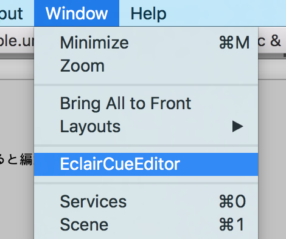

### CueScenePlayer
Unityシーン内の実際のゲームオブジェクトにアタッチして使うコンポーネントです。"Manager"といった名前の空のゲームオブジェクトを作成し、そこにアタッチする使い方を想定しています。特定の`CueScene`を指定すると、それを再生します。
## 任意のメソッドを実行できるようにしなかった理由
`Cue`には`CueEventBase`を継承したクラスに書かれた動作しか関連付けられず、`Cue`発行時に好きなメソッドを好き放題実行することはできません。理由は、「EclairCueMakerを知らない人がプロジェクトファイルを見た時に解読のヒントを与える」ためです。  
実はUnityに標準でEclairCueMakerのような機能があり、Animationがそれに該当します。UnityのAnimationでは、"Event"という概念で好きなタイミングで好きなメソッドを実行できます。しかしこの機能は広くは知られていません。AnimationのEvent機能を知らない人がプロジェクトファイルを見た場合、「なんでか知らないけど効果音が鳴る処理が突然実行される、どこから実行されてるのか分からない…」といった状況に陥ります。  
一方EclairCueMakerでは、アニメーション再生や効果音再生などの処理が走るゲームオブジェクトにはかならず`CueEvent`継承クラスがアタッチされているので、そこを糸口にEclairCueMakerの存在に気づき、解読を進めることができます。

## 導入方法
1. EclairCueMakerをダウンロードまたはgit cloneします。
2. Assets/EclairCueMakerフォルダを、導入したいUnityプロジェクトのAssetsフォルダ以下にコピーします。
3. Assets/Gizmosフォルダを、導入したいUnityプロジェクトのAssetsフォルダにコピーします。

## 主な流れ
### 時間差で処理を実行する
#### 1.CueSceneを作成
Createメニュー>EclairCueSceneを選択し、新たなCueSceneファイルを作成します。

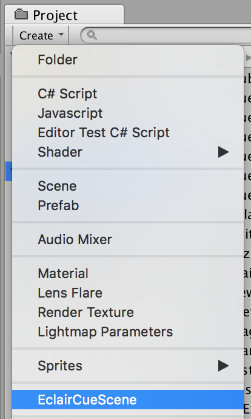
#### 2.CueScenePlayerをアタッチ
処理を時間差で実行したいUnityシーンを開き、好きなゲームオブジェクトに`CueScenePlayer`をアタッチします。
`Manager`といった名前の空のゲームオブジェクトを作成し、そこにアタッチする方法をおすすめしています。
さらに`CueScenePlayer`コンポーネント内の"Cue Scene"パラメーターに、先ほど作成した`CueScene`をアタッチします。

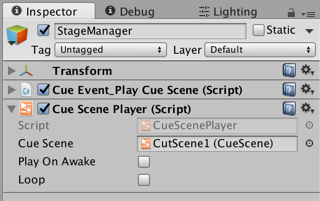  
(Cue Event_Play Cue Sceneについては後ほど説明します。)

Play On Awakeをオンにした場合は、Unityシーンを開いたと同時に`CueScene`の再生を開始します。

#### 3.処理を実行する対象にCueEventをアタッチ
実行したい処理に応じた`CueEvent`を、**実行する対象のゲームオブジェクト**にアタッチします
(CueScenePlayerがアタッチされたゲームオブジェクトではない場合が多いです)
例えば様々な8個の立方体Cube1,Cube2,...,Cube8があり、それらに順番にアニメーションを実行させたい場合、
Cube1からCube8すべてに`CueEvent_PlayAnimState`をアタッチします。

#### 4.CueSceneを作成
Windowメニュー>EclairCueEditorを選択し`CueSceneEditor`を開きます。


[CueSceneEditorでCueSceneを編集する](#cuesceneeditorでcuesceneを編集する)に基づき、CueSceneを編集します。

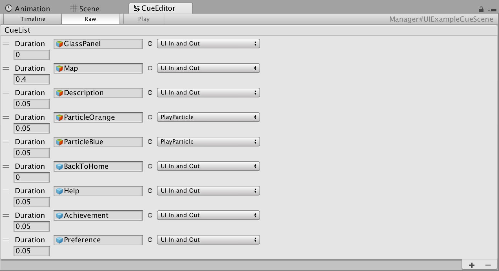  
編集されたCueSceneの例

Play On Awakeがオンである場合は、この時点で、
Unityの再生ボタンを押すとCueSceneの再生が開始します。
Play On Awakeがオフである場合はさらに、
[ステージギミックにより時間差で処理を実行する](#ステージギミックにより時間差で処理を実行する)などの方法により、CueSceneを再生する命令を出す必要があります。

### ステージギミックにより処理を実行する
#### 1.ステージギミックPrefabをプログラマーに作ってもらう
作ってもらってください。
ちなみにここでは、ステージギミックPrefabを、
「`StageGimmickBase`継承クラスがアタッチされたPrefab」と定義しておきます。
#### 2.ステージギミックPrefabを配置する
#### 3.ステージギミックとCueEventを紐付けする
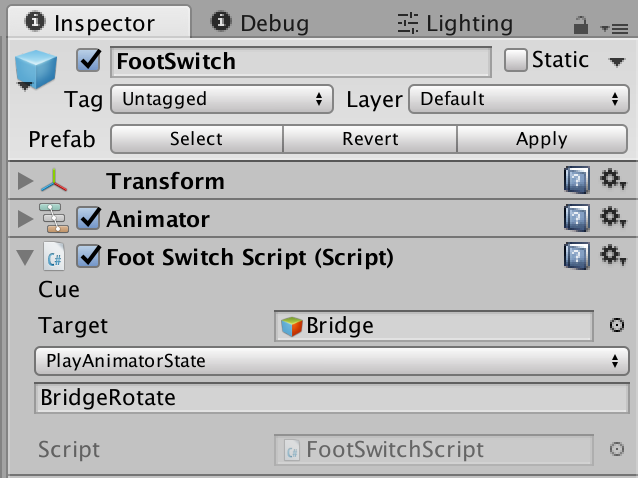  
BridgeゲームオブジェクトのCueEvent_PlayAnimatorStateを指定した例

`CueSceneEditor`で`CueEvent`を指定するときと同様に`CueEvent`の指定を行います。

以上で完了です。
プログラマーが設計した方法でステージギミックを作用させると、指定した`CueEvent`が実行されます。

### ステージギミックにより時間差で処理を実行する
上記2つの混合です。
ステージギミックによりCueSceneを再生させるという動作を実現するため、
CueSceneを再生させるためのCueEvent、"CueEvent\_PlayCueScene"を用意しました。
`CueEvent`には「その`CueEvent`がアタッチされているゲームオブジェクト以外のゲームオブジェクトには原則として影響を与えない」という規則が設けられていますが、CueEvent\_PlayCueSceneはその例外となります。

#### 1.ManagerにCueEvent\_PlayCueSceneをアタッチする


`CueScenePlayer`がアタッチされているゲームオブジェクトに、CueEvent\_PlayCueSceneをアタッチします。

#### 2.ステージギミックのCueEventにCueEvent\_PlayCueSceneを指定する
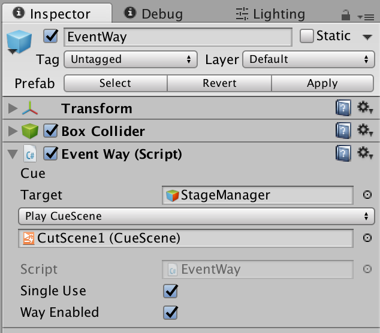

以上で、ステージギミックを作用させると、指定した`CueScene`が再生されます。

## CueSceneEditorでCueSceneを編集する
EclairCueMakerの要となる、CueSceneEditorの使い方です。
編集したいCueSceneをCueEventPlayerにセットし、CueEventPlayerがアタッチされているゲームオブジェクトを選択すると、そのCueSceneが編集可能となります。

`CueSceneEditor`には、CueSceneを表示する2つの方法があります。  
一つがTimeline表示  


もう一つがRaw表示です。  


CueSceneの編集に関しては、現在、Raw表示でのみ対応しています。

### Raw表示での編集
CueSceneに含まれているCueが上から下へ時系列で並んでいます。
右下の + ボタンを押すと、新しいCueを作成します。

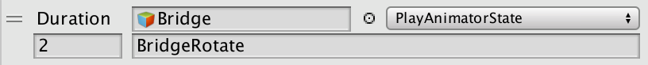  
Cue

"Duration"は、一つ前に実行されたCueからの待機時間を示しています。
Durationより左の領域でCueEventを指定します。
左上に位置しているのが、対象となるゲームオブジェクトです。
このゲームオブジェクトは、CueScenePlayerがアタッチされているゲームオブジェクトと同じシーンに含まれている必要があり、かつ、CueEventコンポーネントをアタッチしている必要があります。

その右は、対象にCueEventコンポーネントが複数アタッチされていた場合に、どのCueEventを実行するかを指定するプルダウンメニューです。
指定した対象が、CueEventコンポーネントを一つもアタッチしていない場合は表示されません。

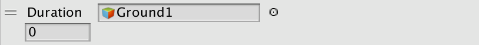  

その下で引数、すなわちパラメーターを指定します。
指定したCueEventが引数を要求するものである場合、引数の種類に応じたGUIが表示されます。
何も表示されない場合は、そのCueEventが引数を要求していないことを意味します。

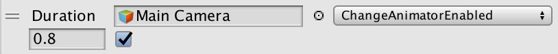  
Bool型の引数を要求するCueEvent ChangeAnimatorEnabledの例


## CueEventを自作する(プログラマー向け)
CueEventコンポーネントの実態は、`CueEventBase`抽象クラスを継承したクラスです。
`CueEventBase`はMonoBehaviourを継承しているので、日頃スクリプトを書くときと同じ感覚で書いて構いません。違うのは、いくつか固有の変数が定義してあるということです。

### テンプレートを修正して作成する

CueEventのテンプレートを用意しました。これを複製してCueEventを作成する方法が最も簡単かと思います。
CueEventのテンプレートを以下に示します。これは、Assets/EclairCueMaker/CueEvent_Template.csと同等の内容です。

``` C#
using UnityEngine;
using System.Collections;
using wararyo.EclairCueMaker;
using System;

public class CueEvent_Template : CueEventBase {

    public override string EventName
    {
        get
        {
            return "**Input name of this CueEvent here**";
        }
    }
    
    public override string EventID
    {
        get
        {
            return "324a94shtj65y5u4l";
        }
    }

    public override Type ParamType
    {
        get
        {
            return typeof(void);
        }
    }

    public override void Cue(object param)
    {
        //ここに任意の処理を記述
    }
}

```

まず、これをコピー・ペーストするか、Assets/EclairCueMaker/CueEvent\_Template.csをUnityエディター上で複製するなどして、CueEvent\_\*.csというスクリプトを作成します。(\*にはお好きなキーワードが入ります。素敵な名前をつけてください)  
作成するフォルダーはどこでも構いません。

次に、スクリプトの編集に入ります。
編集する箇所は

* クラス名
* EventNameプロパティ
* EventIDプロパティ
* ParamTypeプロパティ
* Cueメソッド

の5箇所です。

まずクラス名ですが、これはUnityの規則により、ファイル名と同じにしてください。

EventNameは、CueEventの名前です。Cue編集画面のCueEventリストに表示されます。ファイル名と大体似た名前にしてください。

EventIDは、CueEvent同士を区別する識別子です。ユニークな文字列である(一意的で他と被らない文字列である)必要があります。キーボードをガチャガチャして入力するのがおすすめです。

ParamTypeは、引数の型です。あなたが作るCueEventで引数を要求したい場合は、その引数の型を入力してください。ただし、対応している引数は現時点で多くなく、例えば`Vector3`などは対応していません。
引数を要求しない場合は、`void`型を指定してください。

Cueメソッドは、CueEventが実行された時に実際に実行される処理です。お好きに書いてください。
引数のparamには、あなたがParamTypeで指定した型の値が入っています。object型(UnityEngine.Object型ではない)ですので、ParamTypeで指定したのと同じ型にキャストしてお使いください。

以上を定義さえすれば、他は好き放題書くことができます。

### CueEventを作る上で守って欲しいこと

以上のように、CueEventにはかなりの自由度が確保されていますが、CueEventという概念の一貫性を守るため、守って欲しい規則があります。
それが、

**そのCueEventがアタッチされているゲームオブジェクト以外のゲームオブジェクトには、
可能な限り影響を与えない**

です。
Unity標準のUnityEventを用いずCueEventという概念を作った一番の理由が、プログラムが実行される流れの見通しを良くすることです。
CueEventが他のゲームオブジェクトに影響を与えてしまうようでは、[任意のメソッドを実行できるようにしなかった理由](#任意のメソッドを実行できるようにしなかった理由)で述べたように「どこから実行されてるのかわからない」状態に陥り、CueEventのうまみが失われてしまいます。

## ステージギミックPrefabを自作する(プログラマー向け)
ステージギミックPrefabとは、`StageGimmickBase`継承クラスがアタッチされたPrefabという意味です。
プログラマーがこれを作成することで、非プログラマーのメンバーにもステージギミックを作成させることが可能になります。

ステージギミックPrefabの例としては、足で踏むと反応する感圧スイッチ、プレイヤーが通ると何かが起こる通過ポイントなどが考えられます。

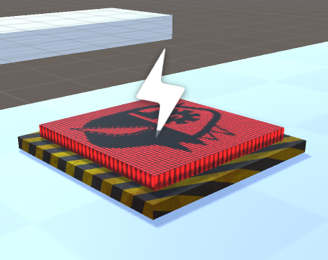  
感圧スイッチ

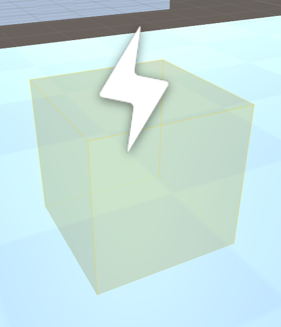  
通過ポイント

### 主な流れ

1. 新しいスクリプトを作成し、wararyo.EclairCueMaker.StageGimmickBaseクラスを継承する(wararyo.EclairCueMakerは名前空間です)
2. ステージギミックの挙動を通常のスクリプトと同様に記述した後、そのステージギミックが使用されたタイミングで`DispatchEvent()`メソッドを実行する
3. そのスクリプトをゲームオブジェクトにアタッチする
4. Prefab化する

### 自動的に提供される機能

`StageGimmickBase`継承クラスをゲームオブジェクトにアタッチすることで自動的に提供される機能があります。

#### ステージギミックであることを示すアイコンをSceneビューに表示する
稲妻アイコンが表示されます。

#### 実行するCueEventを指定する領域をインスペクターに表示する
  
CueSceneEditorでCueEventを指定するときと同等のGUIがインスペクターに表示されます。
通常のスクリプトと同じく、シリアライズ可能な変数(publicな変数など)を宣言した場合のGUIも表示されます。

#### ステージギミックのターゲットをSceneビュー上で示す
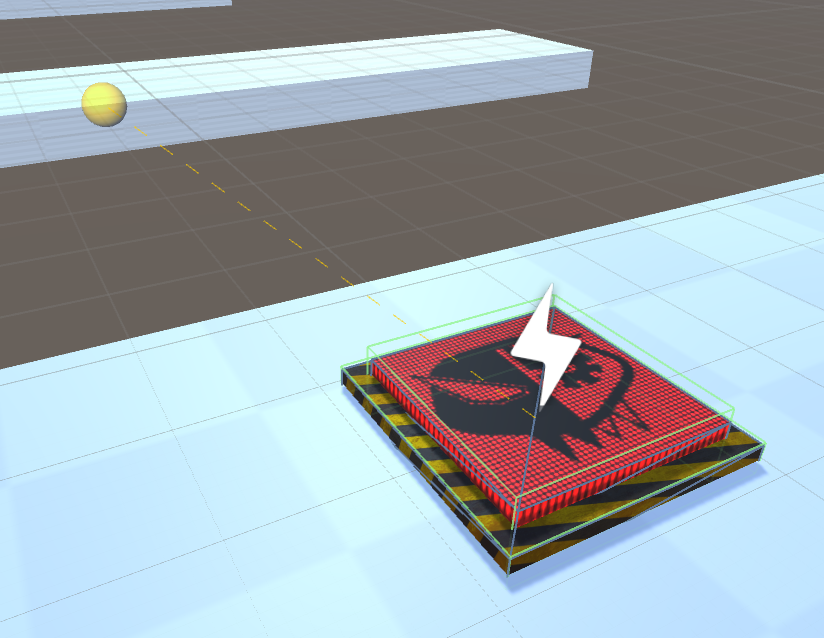  
ステージギミックPrefabとそのターゲットとの間に線が表示されます。

### サンプル
"Player"タグが割り当てられた物体が通過した時にCueEventを発行するステージギミック"EventWay"内のEventWayスクリプトの内容を簡略化したものです。
フルバージョンのEventWayはリポジトリ内のStageExampleを参照ください。

``` C#
using UnityEngine;
using System.Collections;
using wararyo.EclairCueMaker;
using System;

public class EventWay : StageGimmickBase {

	private void OnTriggerEnter(Collider collider){
		if (collider.gameObject.tag == "Player") {
			DispatchEvent ();
		}
	}
}
```

## CueScenePlayerをカスタマイズする(プログラマー向け上級)
`CueScenePlayer`クラスを継承することで、独自のCueScenePlayerを作成することができます。
OnCursorChangedメソッドをoverrideすることで、CueEventが実行された時に任意の処理を実行することができます。
詳しい説明はしないので、自分でCueScenePlayerのソースコードを見て頑張ってください。